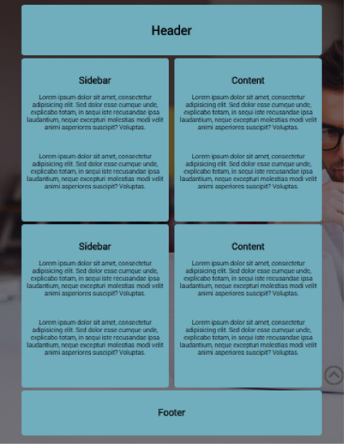

# Challenge: Media Query

Continuing from the Challenge 2 from Lesson 4 



```html
<style type="text/css"> 

  /* Normal CSS goes here... */
  
  @media screen and (min-width: 400px){ 
    p {
      font-size: 40px;
    } 
    .box {
      text-align: left; background-color:#eee; border-color: white;
    }
    /* min-width for desktop */
  } 
</style>
```

1. Add the code from the media query above the the CSS of your page.
2. Resize the page the see the media query in action.
3. Add another media query which affects screens over 1000px in width, for this:
    - add a border to the box class
    - change the colour of the text to white
