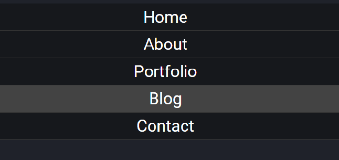
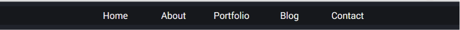

# Challenge: Walkthrough NavBar

We will begin with a HTML template (see lesson folder navigation.html) add the following HTML and CSS.

Let us start with a simple unordered list of links `<a>` using `<ul>` and `<li>` tags.

```html
<nav>
  <ul>
     <li><a href="#">Home</a></li>
     <li><a href="#">About</a></li>
     <li><a href="#">Portfolio</a></li>
     <li><a href="#">Blog</a></li>
     <li><a href="#">Contact</a></li>
  </ul>
</nav>
```

```css
nav ul li a {
     display: block;
     text-decoration: none;
     font-family: roboto;
     color: #fff;6. 
}
```

The navigation bar should start to look something like what is shown below:


### Center Elements

Now we need to remove the bullets from the list, and align the text to the centre of the web-page.

```css
nav ul {
     list-style: none;
     text-align: center;4.  
}
```

See how the list is still visible and centred, but the bullets are no more.
 


### Style and Hover

Now that have the list let's style them and  add a transition effect on hover. We will style the `<li>`  by including some `padding`, `background-color` and a `border-bottom`. The `display: block` for the `<a>`` gives the links a clickable area that is the full width of element rather than just over the text.

```css
nav ul li {
     font-size: 30px;
     border-bottom: 1px solid #444;
     padding: 10px 5px;
     background-color: #1D2026;
}
```

```css
nav ul li:hover {
     background-color: #555;
     transition: all .3s ease;
}
```

```css
nav ul li a {
     display: block;
     ...
}
```

You can see from the below image that the links now look more like navigation bar.
 


### Add media Query

In our navigation bar we will give the _media_ query a _min-width_ of 665px. For the desktop version we will change it to _inline-block_ with a _width_ of 120px. To finish, we will remove the _border-bottom_.

```css
@media screen and (min-width: 665px) {
   nav ul li {
        display: inline-block;
        width: 120px;
        font-size: 20px;
        border-bottom: none;
   }
}
```

Note: 
As we have mentioned before, by default inline-block adds a small margin between elements of the web-page. 


To remove this we can give the <nav> a font-size of 0 in the media query.

```css
@media screen and (min-width: 665px) {
    nav {
        font-size: 0;  /* remove spacing issue*/
    }
    nav ul li {
        display: inline-block;
        width: 120px;
        font-size: 20px;   /* insure font size not 0 */
        border-bottom: none;
   }
}
```

The navigation bar has now lined up across the top of the web-page.


Finally we can make the navbar the full width of the screen by setting the background-color of the <ul> to that of the navbar.



Now we have a fully fledged responsive navigation bar for our site.
