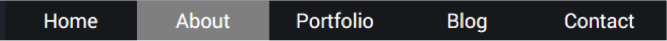

# Challenge: pseudo-tag _active_

Continuing from the previous challenge, add an active pseudo class to the `<li>` tag.
When links are active change the following:
- background colour to white

¿Why did I not use the `<a>` tag instead of `<li>`?

