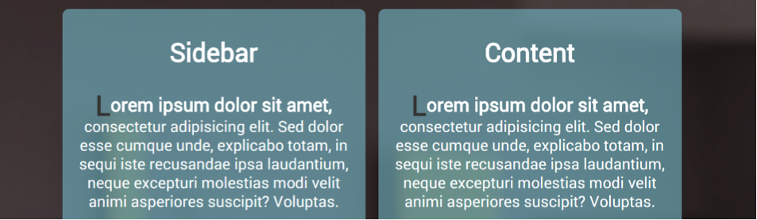

# Challenge: Pseudo elements

Return to Challenge 1 of today's lesson.

1.	Comment out the media query for now.
2.	Use pseudo Elements to enlarge the first line of every paragraph
3.	Enlarge the first letter of every paragraph

