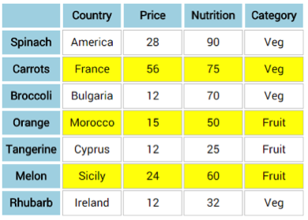
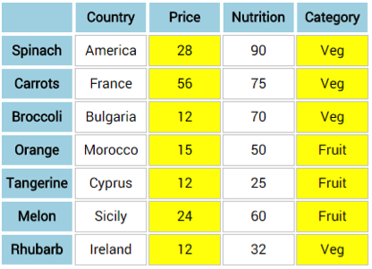
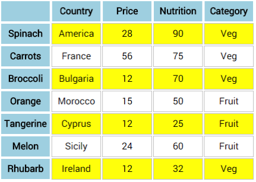

# Challenge: tables

Create tables with the following styled layout:
 

  

  
 
  

 
_Hint: as well as add numbers we can also subtract numbers._
  
_Hint: Using expressions to select elements can be very powerful, you can however use even and odd to achieve the more common layouts._

```css
 tr:nth-child(odd) {  
    background-color: yellow;
 }
```
