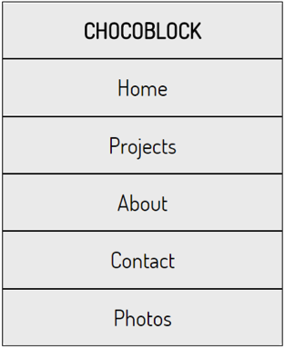

#Mobile First Landing Page

We are going to continue from or last Challenge and create a mobile first landing page. We will use some of this lesson's topics as they come up.
 


Open up the responsive navigation challenge from the last lesson



First a few design changes _(you can change the styling to whatever you wish but best wait until you are finished coding)

- Remove the grey `background-color` from the `<nav>`
- Give the `<body>` a background color of `#F5D76E` 
- Change the colour of the text and border to `white` (`#fff`)
- Adjust the font size until you are satisfied
- Change the border on `<a>` for border-bottom only
 
###`reset.css` 

First we are going to include a reset.css file, this will alter some of the default fonts and margins, just resize them after to your preference.

- Download the reset.css file (in the lesson folder) and  include it it the head of the document. 

```html
    <link rel="stylesheet" type="text/css" href="reset.css">
```


###The HTML

mobile  


desktop  


We are going to add a message/tagline and an image after the nav. In the desktop version we will align them side-by-side so we should take that into account. Flexbox will work well here. Let's call this section _landing_.  Inside a landing `<section>` we will have two divs.

- landing `<section>` 
    + landing-message `<div>`
    + landing-graphic `<div>`

- The landing message can be a `<h2>` and you can find an image in the lesson folder.
- In this case, the landing div will be the flexbox container . The landing-message and landing-image are the flex-items.
- Style the font as you wish, the Dosis font-family was used in the example
- Position the flex-items using justify-content and align-items.

###Media Query
- The desktop version should have the landing-message and landing-image side-by-side.  Use Flexbox for this.
- You may want to adjust the landing div.Use margins to center and give it space where it needs.

