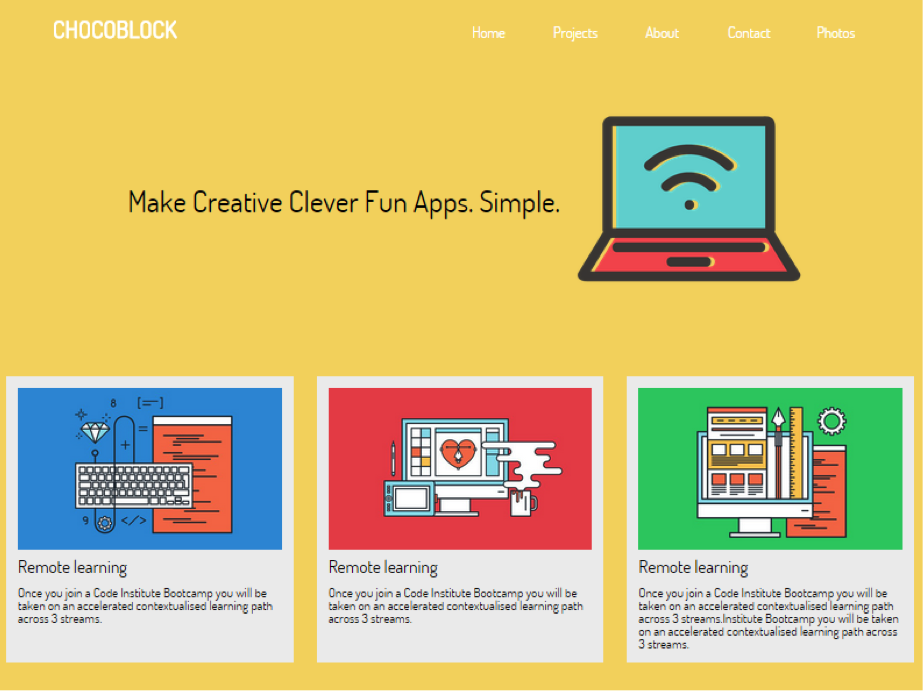

#Cards in the landing page

Continuing from the previous Challenge , we will add a series of design element in the form of cards. Each will have an image, heading and paragraph.

mobile  

 
desktop  


The HTML for a single card is as follows(images in lesson folder):

```html
<section class="card-container">
        <div class="card">
             
             <h2>Web Info Sessions</h2>
             <p>If you have questions about your career in...</p>
        </div> 
</section>
```

Firstly, we should create a mobile version of the cards using CSS.

Below is a shell for the CSS classes. The challenge is to replace code here with CSS rules:

```css
.card-container{
        /*code here*/
}
.card{
        /*code here*/
}
.card h2{
        /*code here*/
}
.card img{
        width:100%;
        }
.card p{
        font-family: dosis;
        font-size: 22px;
}
```

> Hint: `.card-container` is a perfect flexbox container

Add two more cards.
