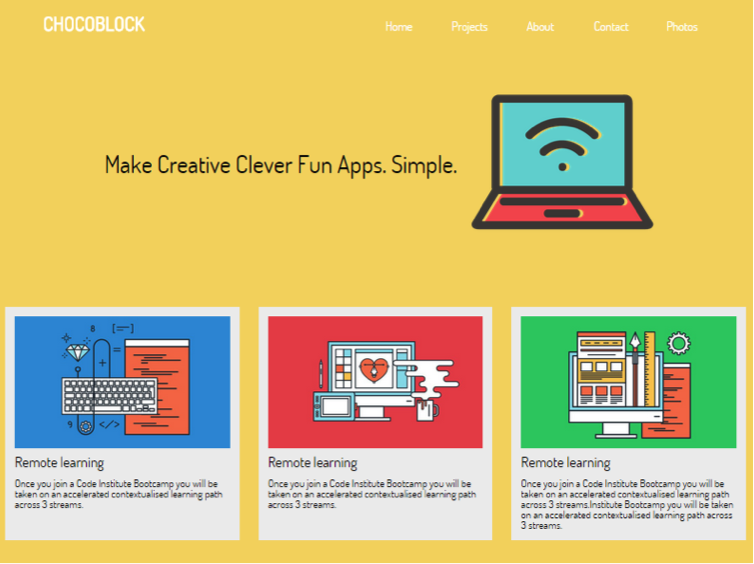

#Desktop Landing Page
  
 

Continuing from the previous challenge. Let’s create the layout design for desktop. We can do this using the media query here. 
We need to change a few flexbox properties. 

```css
@media screen and (min-width: 700px){
    ... 

    .card-container{
        /* code here*/
    }
}
```


> Hint: One way to get the layout involves using `flex-wrap
 
If you got this far, well done, flexbox can be tricky to begin with but with a little practice it make laying out responsive pages quick and relatively painless.

